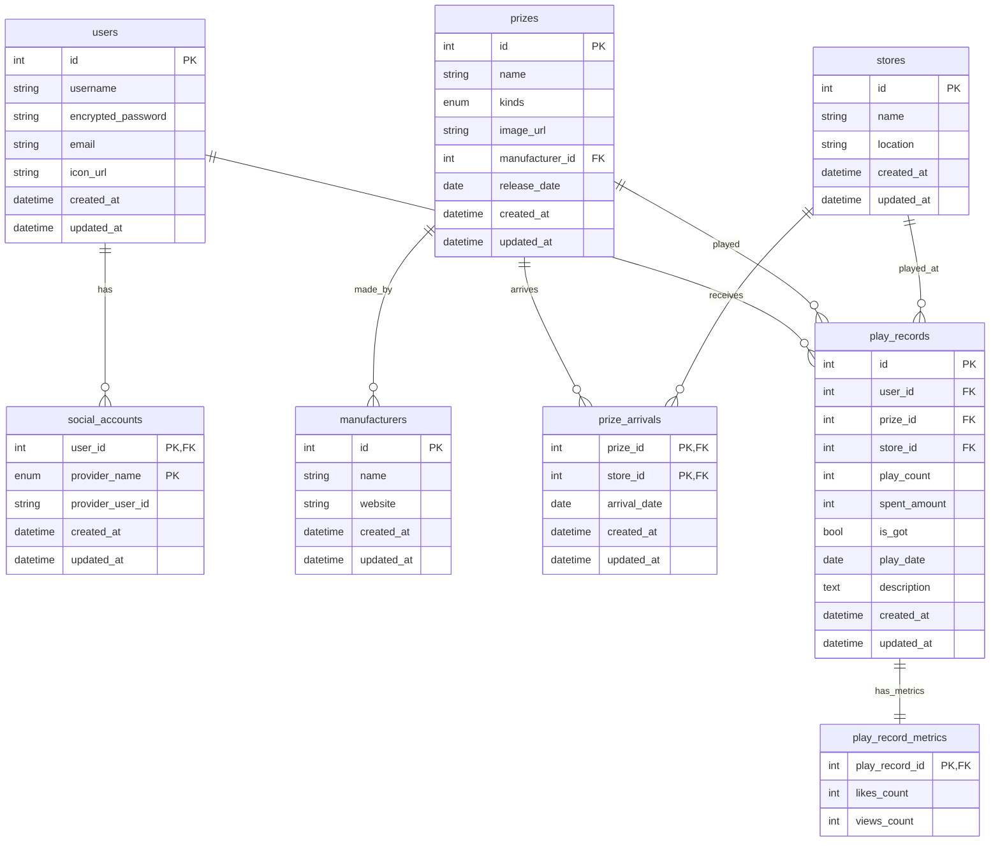

## ER 図

---

## テーブル定義詳細

### users（ユーザー情報）

| カラム名           | 意味                 | PK  | FK  | データ型 | NOT NULL | DEFAULT           | UNIQUE |
| ------------------ | -------------------- | --- | --- | -------- | -------- | ----------------- | ------ |
| id                 | ユーザー ID          | 〇  |     | int      | 〇       | auto_increment    |        |
| username           | ユーザー名           |     |     | string   | 〇       |                   | 〇     |
| encrypted_password | 暗号化済みパスワード |     |     | string   | 〇       |                   | 〇     |
| email              | メールアドレス       |     |     | string   | 〇       |                   |        |
| icon_url           | アイコン画像 URL     |     |     | string   |          |                   |        |
| created_at         | レコード作成日時     |     |     | datetime | 〇       | CURRENT_TIMESTAMP |        |
| updated_at         | レコード更新日時     |     |     | datetime | 〇       | CURRENT_TIMESTAMP |        |

### social_accounts（ソーシャル認証アカウント情報）

| カラム名         | 意味                            | PK  | FK  | データ型 | NOT NULL | DEFAULT           | UNIQUE |
| ---------------- | ------------------------------- | --- | --- | -------- | -------- | ----------------- | ------ |
| user_id          | users テーブルの ID             | 〇  | 〇  | int      | 〇       |                   |        |
| provider_name    | 認証プロバイダー名（enum 管理） | 〇  |     | enum     | 〇       |                   |        |
| provider_user_id | プロバイダー側のユーザー ID     |     |     | string   | 〇       |                   |        |
| created_at       | レコード作成日時                |     |     | datetime | 〇       | CURRENT_TIMESTAMP |        |
| updated_at       | レコード更新日時                |     |     | datetime | 〇       | CURRENT_TIMESTAMP |        |

### prizes（プライズ情報）

| カラム名        | 意味                        | PK  | FK  | データ型 | NOT NULL | DEFAULT           | UNIQUE |
| --------------- | --------------------------- | --- | --- | -------- | -------- | ----------------- | ------ |
| id              | プライズ ID                 | 〇  |     | int      | 〇       | auto_increment    |        |
| name            | プライズ名                  |     |     | string   | 〇       |                   | 〇     |
| kinds           | プライズ種類（enum 管理）   |     |     | enum     | 〇       |                   | 〇     |
| image_url       | 画像 URL                    |     |     | string   |          |                   |        |
| manufacturer_id | manufacturers テーブルの ID |     | 〇  | int      | 〇       |                   | 〇     |
| release_date    | 発売日                      |     |     | date     |          |                   |        |
| created_at      | レコード作成日時            |     |     | datetime | 〇       | CURRENT_TIMESTAMP |        |
| updated_at      | レコード更新日時            |     |     | datetime | 〇       | CURRENT_TIMESTAMP |        |

### manufacturers（メーカー情報）

| カラム名   | 意味             | PK  | FK  | データ型 | NOT NULL | DEFAULT           | UNIQUE |
| ---------- | ---------------- | --- | --- | -------- | -------- | ----------------- | ------ |
| id         | メーカー ID      | 〇  |     | int      | 〇       | auto_increment    |        |
| name       | メーカー名       |     |     | string   | 〇       |                   | 〇     |
| website    | 公式サイト URL   |     |     | string   |          |                   |        |
| created_at | レコード作成日時 |     |     | datetime | 〇       | CURRENT_TIMESTAMP |        |
| updated_at | レコード更新日時 |     |     | datetime | 〇       | CURRENT_TIMESTAMP |        |

### stores（店舗情報）

| カラム名   | 意味             | PK  | FK  | データ型 | NOT NULL | DEFAULT           | UNIQUE |
| ---------- | ---------------- | --- | --- | -------- | -------- | ----------------- | ------ |
| id         | 店舗 ID          | 〇  |     | int      | 〇       | auto_increment    |        |
| name       | 店舗名           |     |     | string   | 〇       |                   | 〇     |
| location   | 住所・設置場所   |     |     | string   |          |                   |        |
| created_at | レコード作成日時 |     |     | datetime | 〇       | CURRENT_TIMESTAMP |        |
| updated_at | レコード更新日時 |     |     | datetime | 〇       | CURRENT_TIMESTAMP |        |

### prize_arrivals（景品入荷情報）

| カラム名     | 意味                 | PK  | FK  | データ型 | NOT NULL | DEFAULT           | UNIQUE |
| ------------ | -------------------- | --- | --- | -------- | -------- | ----------------- | ------ |
| prize_id     | prizes テーブルの ID | 〇  | 〇  | int      | 〇       |                   | 〇     |
| store_id     | stores テーブルの ID | 〇  | 〇  | int      | 〇       |                   | 〇     |
| arrival_date | 入荷日               |     |     | date     | 〇       |                   | 〇     |
| created_at   | レコード作成日時     |     |     | datetime | 〇       | CURRENT_TIMESTAMP |        |
| updated_at   | レコード更新日時     |     |     | datetime | 〇       | CURRENT_TIMESTAMP |        |

### play_records（プレイ記録）

| カラム名     | 意味                 | PK  | FK  | データ型 | NOT NULL | DEFAULT           | UNIQUE |
| ------------ | -------------------- | --- | --- | -------- | -------- | ----------------- | ------ |
| id           | プレイ記録 ID        | 〇  |     | int      | 〇       | auto_increment    |        |
| user_id      | users テーブルの ID  |     | 〇  | int      | 〇       |                   |        |
| prize_id     | prizes テーブルの ID |     | 〇  | int      | 〇       |                   |        |
| store_id     | stores テーブルの ID |     | 〇  | int      | 〇       |                   |        |
| play_count   | プレイ回数           |     |     | int      | 〇       | 1                 |        |
| spent_amount | 消費金額（円）       |     |     | int      | 〇       | 0                 |        |
| is_got       | 獲得したかどうか     |     |     | bool     | 〇       | false             |        |
| play_date    | プレイ日             |     |     | date     | 〇       |                   |        |
| description  | 説明文               |     |     | text     |          |                   |        |
| created_at   | レコード作成日時     |     |     | datetime | 〇       | CURRENT_TIMESTAMP |        |
| updated_at   | レコード更新日時     |     |     | datetime | 〇       | CURRENT_TIMESTAMP |        |

### play_record_metrics（プレイ記録メトリクス）

| カラム名       | 意味          | PK  | FK  | データ型 | NOT NULL | DEFAULT | UNIQUE |
| -------------- | ------------- | --- | --- | -------- | -------- | ------- | ------ |
| play_record_id | プレイ記録 ID | 〇  | 〇  | int      | 〇       |         |        |
| likes_count    | いいね数      |     |     | int      | 〇       | 0       |        |
| views_count    | 閲覧数        |     |     | int      | 〇       | 0       |        |
