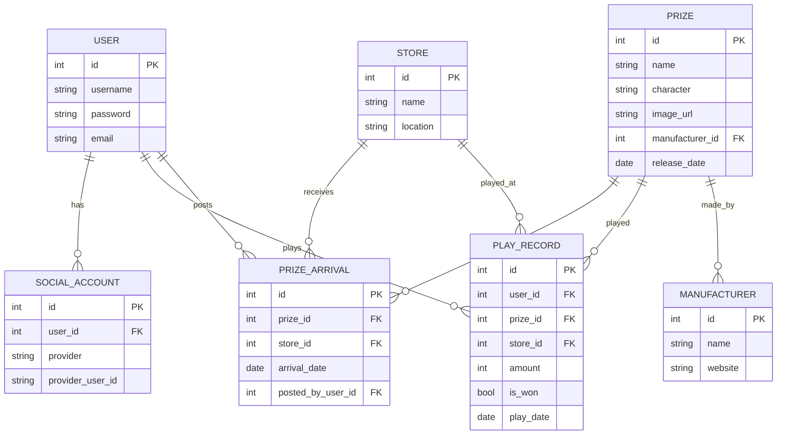

# ER 図

```mermaid
erDiagram
    USER {
        int id PK
        string username
        string password
        string email
    }
    SOCIAL_ACCOUNT {
        int id PK
        int user_id FK
        string provider
        string provider_user_id
    }
    PRIZE {
        int id PK
        string name
        string character
        string image_url
        int manufacturer_id FK
        date release_date
    }
    MANUFACTURER {
        int id PK
        string name
        string website
    }
    STORE {
        int id PK
        string name
        string location
    }
    PRIZE_ARRIVAL {
        int id PK
        int prize_id FK
        int store_id FK
        date arrival_date
        int posted_by_user_id FK
    }
    PLAY_RECORD {
        int id PK
        int user_id FK
        int prize_id FK
        int store_id FK
        int amount
        bool is_won
        date play_date
    }

    USER ||--o{ SOCIAL_ACCOUNT : has
    USER ||--o{ PLAY_RECORD : plays
    USER ||--o{ PRIZE_ARRIVAL : posts
    PRIZE ||--o{ PRIZE_ARRIVAL : arrives
    PRIZE ||--o{ PLAY_RECORD : played
    PRIZE ||--o{ MANUFACTURER : made_by
    STORE ||--o{ PRIZE_ARRIVAL : receives
    STORE ||--o{ PLAY_RECORD : played_at

```
